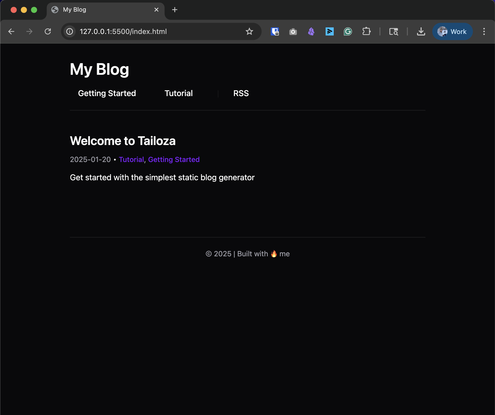
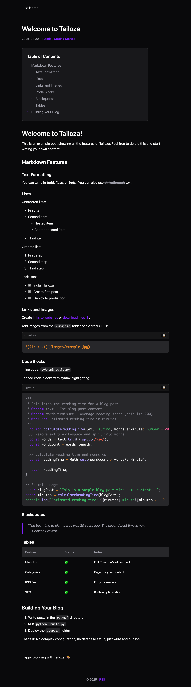

# Tailoza Static Blog

I spent a weekend building this because I wanted a stupid simple static blog with a markdown backend.

The cognitive load required to lob my un-filtered thoughts onto the internet seemed unnecessary...

Of course, you could pay a subscription to a hosting provider, but I don't want to.

<p align="center">
  
</p>


## Here's the Deal

I built Tailoza because I wanted to write, not wrestle with config files.

**Tailoza Lets You:**
- Write in Markdown (eg. [Obsidian](https://obsidian.md/))

- Run one command

- Get a beautiful site

- Deploy anywhere

That's it. No React. No databases. No subscriptions!


## The 2-Minute Setup (I'm Not Kidding)

```bash

git clone https://github.com/impish0/Tailoza.git

cd Tailoza

```

Now write your first post:

```bash

echo "---

title: My First Post
date: 2025-01-20

---

Hello world. I'm blogging!" > posts/my-first-post.md

```

Build it:

```bash

python3 build.py

```

Done. Your blog is in the `output/` folder.

Want to see it live while you work?

```bash

python3 serve.py

```

Now it's at http://localhost:8000 and auto-rebuilds when you save. Magic.

Upload that folder literally anywhere that serves HTML. GitHub Pages, Netlify, your old shared hosting from 2003 - doesn't matter.

(if you don't know how to do that, i'll make some tutorials soon)


## What You're Getting


<p align="center">
  
</p>

**The Good Stuff:**

- Beautiful shadcn-inspired design (light & dark mode)

- Categories For Posts

- Auto-generated table of contents

- Decent SEO 

- RSS feed

- Syntax highlighting

- Lightning-fast search (try it, it's slick)

- Reading time estimates

- Pagination (no more endless scrolling)


## How to Use This Thing


### Writing Posts

Drop markdown files in `posts/`. Here's all the frontmatter options:

```markdown
---
title: Your Post Title                               # Required
date: 2024-01-20                                    # Required (YYYY-MM-DD)
description: Short SEO description                   # Shows in previews & search results
categories: Business, Tech, Whatever                 # Comma-separated, creates category pages
keywords: seo, keywords, for, google                # Optional SEO boost
author: Your Name                                   # Optional, defaults to config
image: hero-image.jpg                               # Social media preview image
toc: true                                          # Auto-generates table of contents
---

Your content here. Write like a human.
```

**Pro tip**: Check out `posts/example-post.md` for a full demo of every feature in action.

### Draft Posts

Working on something not ready for prime time? Prefix your filename with underscore:

```
_draft-post.md      # Won't be published
_ideas.md           # Ignored by build
my-post.md          # This one gets built
```

Simple. No "draft: true" nonsense. Just underscore it.

### Make It Yours


Edit `config.json`:

```json
{
  "site_title": "Your Blog Name",          // Your blog's name (appears in header)
  "site_url": "https://yourdomain.com",    // Full URL without trailing slash
  "site_description": "What you're about",  // SEO description for your site
  "author": "You",                         // Default author (can override per post)
  "footer_text": "© 2024 Your Name",      // Footer text (can include HTML/emoji)
  "theme": "dark",                         // "dark" or "light" theme
  "posts_per_page": 20,                    // Posts per page before pagination
  "timezone": "+0000",                     // Your timezone for RSS feeds (e.g., "-0500" for EST)
  "post_url_prefix": "/posts",             // URL structure for posts (see below)
  "plausible_domain": "yourdomain.com",     // Optional: Enable Plausible Analytics
  "plausible_options": ["hash"],            // Optional: Advanced Plausible tracking
  "rss_full_content": true                  // RSS: full article in readers (true) or summary (false)
}
```

**Config Options Explained:**

- **site_title**: Shows in the browser tab and site header
- **site_url**: Used for generating absolute URLs (RSS, sitemap, social cards)
  - Must start with `http://` or `https://`. Trailing slash is removed automatically.
- **site_description**: Used in meta tags and RSS feed
- **author**: Default author for posts (override with `author:` in post frontmatter)
- **footer_text**: Appears at the bottom of every page (HTML allowed)
- **theme**: Choose "dark" or "light" mode
- **posts_per_page**: How many posts before pagination kicks in
- **timezone**: Used for RSS pubDate (format: +/-HHMM, e.g., "+0530" for IST)
  - Examples: `-0800` Pacific (PST), `-0500` Eastern (EST), `+0000` UTC, `+0100` CET, `+0530` IST, `+0900` JST
  - Heads up: This is a fixed offset. It does not auto-switch for daylight savings.
- **post_url_prefix**: Customize your URL structure:
  - `"/posts"` (default) → `yourdomain.com/posts/my-post.html`
  - `"/blog"` → `yourdomain.com/blog/my-post.html`
  - `""` (empty) → `yourdomain.com/my-post.html`
- **plausible_domain**: Your domain for Plausible Analytics (optional, leave empty to disable)
- **plausible_options**: Advanced Plausible tracking options (optional array)
  - Supported: `hash`, `outbound-links`, `file-downloads`, `404`, `custom-events`, `local`, `manual`, `compat`
- **rss_full_content**: When `true` (default), your RSS feed includes the full article content. When `false`, the feed shows a short description with title, author and link.

**Migrating from another platform?** The `post_url_prefix` option helps preserve your SEO when moving from WordPress, Ghost, or other platforms.

### Images (Drop 'em In)

Put images in the `images/` folder. Reference them in your posts:

```markdown

```

Whatever you put in the square brackets becomes the alt text. Be descriptive - it helps with SEO and accessibility:

```markdown
     # Good
                           # Bad
                                   # Terrible
```

You can also use the full path if you want:

```markdown

```

Both work. The build process sorts out the paths.

### Favicon

Want a favicon? Drop one of these in your project root or assets folder:
- `favicon.ico`
- `favicon.png` 
- `favicon.svg`

The build finds it and adds it to your site. No config needed.

### Categories (They Just Work)


Add categories to any post:

```yaml

categories: Marketing, Business, Whatever

```

Boom. Automatic category pages at `/categories/marketing.html`.

### Social Preview Images

Want a nice preview when your post gets shared on Twitter/LinkedIn/Whatever?

```yaml
image: hero-image.jpg
```

Put it in your frontmatter. The image shows up in social cards. That's it.

### Table of Contents


Got a long post? Add `toc: true` to the frontmatter. It'll generate a nice floating TOC from your headings. Your readers will thank you.

### Search (It's Fast)

Click the search link. Type something. It searches everything - titles, content, categories. Results show up instantly with your search terms highlighted. No backend needed, it's all client-side magic.

### Analytics (If You Want Them)

Want to see who's reading your stuff? Add this to your `config.json`:

```json
{
  "plausible_domain": "yourdomain.com"
}
```

That's it. Tailoza automatically adds the Plausible Analytics script to every page.

**Want more detailed tracking?** Add advanced options:

```json
{
  "plausible_domain": "yourdomain.com",
  "plausible_options": ["hash", "outbound-links", "file-downloads"]
}
```

**Available options:** (see the official guide: [Plausible Script Extensions](https://plausible.io/docs/script-extensions))
- `hash` - Track heading/anchor clicks (perfect for TOC links)
- `outbound-links` - Track external link clicks  
- `file-downloads` - Track PDF/file downloads
- `404` - Track 404 error pages
- `custom-events` - Enable custom event tracking
 - `local` - Load a local/proxied script variant to reduce ad-blocking
 - `manual` - Disable automatic pageview tracking (you call events manually)
 - `compat` - Compatibility script for older browsers/ad blockers

**Why Plausible?**
- Privacy-focused (no cookies, GDPR compliant)
- Lightweight (< 1KB script)
- Simple dashboard
- No creepy tracking

**How to set it up:**

1. Sign up at [plausible.io](https://plausible.io)
2. Add your domain to your Plausible account
3. Add `"plausible_domain": "yourdomain.com"` to config.json
4. Build your site: `python3 build.py`
5. Deploy

Done. You'll start seeing stats in your Plausible dashboard.

**Don't want analytics?** Just leave out the `plausible_domain` field. Zero tracking scripts get added.

If you want to customize the script or add auto-tracking enhancements, read the [Plausible Script Extensions](https://plausible.io/docs/script-extensions) guide. For getting started end-to-end, see the [Plausible setup docs](https://plausible.io/docs/).

### RSS (Full posts vs summaries)

Your readers using feed apps should get the good stuff.

- **Default behavior**: Tailoza ships RSS with full content enabled. Feed readers will show your entire post right in the app.
- **Config switch**: Set `"rss_full_content": false` if you prefer summary-only feeds (title, description, author, link).
- **How many posts**: The feed includes your latest 10 posts.
- **URLs**: Generated using `site_url` and `post_url_prefix` so links are always absolute.
- **Content tag**: Full posts are placed in `content:encoded` per spec.

Example snippet:

```json
{
  "rss_full_content": true,
  "timezone": "+0000"
}
```

## The Philosophy (Why I Built This)


I've built million-dollar businesses. I've also wasted countless hours on "modern" blogging platforms (all of them)

Here's what I learned:

- **Simple beats complex** - Every. Single. Time.

- **Fast beats features** - Your readers don't care about your framework

- **Writing beats configuring** - Spend time on content, not setup

This tool does one thing: **turns markdown into a beautiful blog**.

No more. No less.


## Deploy This Thing


### GitHub Pages


1. Build: `python3 build.py`
2. Push the `output/` folder
3. Turn on Pages in settings
4. You're live


### Anywhere Else


1. Build: `python3 build.py`
2. Upload the `output/` folder
3. That's it

I'm not kidding. It's just HTML files.


## Want to Contribute?


Cool. I built this in a weekend, so there's probably room for improvement.

- Find a bug? Open an issue
- Want a feature? PR it
- Think something sucks? Tell me why

Just keep it simple. That's the whole point.


## One More Thing


Stop overthinking your blog setup.

Write some things that matter to you, and send it somewhere.

Tailoza gets out of your way so you can focus on what matters: **your content**.

Now stop reading this README and go write something.

---

Built with 🔥 by [Dustin Hogate](https://dustinhogate.com)

***P.S. -*** If this saves you time, use that time to hug your kids, walk your dog, or kiss your SO.

***P.P.S. -*** If you are mad about yet another blog repo - consider this: I built it for me, not you. But you are free to use it, copy it or ignore it.